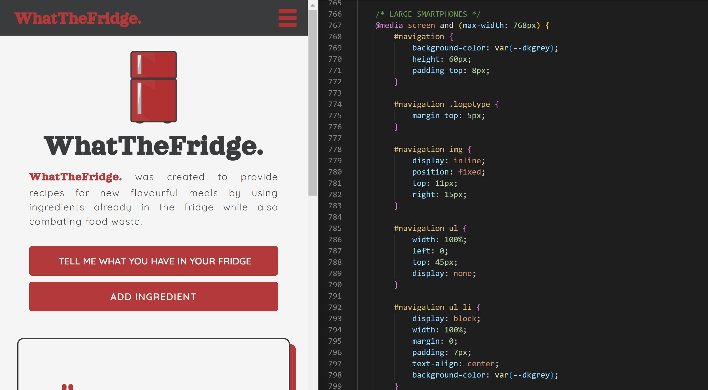

# WhatTheFridge.
A collaboration by: Jessica Dittrich & William Liao & Mubashera Mashraka & Taylor Moss

## Objective 
WhatTheFridge. was developed to combat food waste and maximize the value of exisiting food in the home. In this effort, the user would provide the names of ingredients that they have in their possession. The website, in return, provides a list of possible recipies and allows the user to save and/or add the recipies they have chosen to utilize. Additionally, a quotation section on the user interface encourages the user to persevere and contribute to the minimization of food waste and develop a healty habit of curating one's own food. 

## Approach
In order to create a distraction free and efficiently accessible website, a minimalistic and clean cut user interface was curated, allowing all the attention to be on the ingredients and recipies discovered. However, to combat apathy, a fun quote related to food is posted to make the application fun. 

Desktop User Interface

Mobile User Interface

## External Sources
- CSS Framework: "Bulma" is used to create the very minimal wireframe
- First API: "Yummly" is used to discover recipies in accordance to the ingredients posted by the user, to create a collection of possible dishes 
- Second API, "Famous Quotes" is used to generate a new quote every few seconds to add an element of fun 

## Assigned Tasks
- Will: Initial Concept, API Research, Fetch Recipe API, JavaScript Lead
- Taylor: Brand Name, API Research, JavaScript Support, Slides
- Mubashera: API Research, JavaScript Support, Slides, ReadMe
- Jessica: Brand Elements, HTML, CSS, Bulma, Fetch Famous Quotes API, JavaScript Support, Slides, API Research

## Reflection
Completion of the project was assured upon outright satisfaction of the team members. However, upon intensive testing, a distruptancy was notice: that the API Yummly had advertised that recipies were pulled based on ingrdients while in reality, it was not entirely the case. Recipies are pulled from the title name, which rather unfortunately, was not our intention with this project. Pulling ingredients seems to be a locked and paid feature. Upon the finalization of the project and creating everything surrounding this API, it was decided that we would not switch and proceed with this as it does still reach our target audience.

## Final product
[Click here to view](https://jessicamdittrich.github.io/PRJ-WTMJ060622/)

